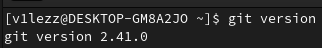
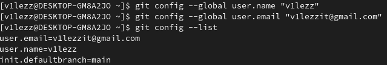

# Шпаргалка по работе с Git
## Cодержание
- [Установка Git](https://github.com/v1lezz/Git-Learner/README.md#установка-git)
- [Проверка наличия Git в системе и ее версии](https://github.com/v1lezz/Git-Learner/README.md#проверка-наличия-git-в-системе-и-ее-версии)
- [Настройка Git](https://github.com/v1lezz/Git-Learner/README.md#настройка-git)
	
## Установка Git
### Windows	
### MacOS
#### 1 способ - через консоль:
Откройте консоль и выполните команду `/usr/bin/git`. Она запустит установщик. Нажмите **Install** и дождитесь окончания установки.

#### 2 способ - использование Homebrew:
- Перейдите [на официальный сайт Homebrew](https://brew.sh/).
- Скопируйте команду для установки — справа от неё есть символ для копирования. Нажмите на него, чтобы команда попала в буфер обмена.

- Найдите программу Terminal в поиске Spotlight или в списке программ. Вставьте скопированный текст в окно терминала и нажмите `Enter`.

### Linux

Для установки Git на Linux нужно использовать терминал. Найдите программу Terminal в поиске или в списке программ. Перейдите на [официальный сайт Git](https://git-scm.com/download/linux) и выберите команду установки для своей версии Linux. Скопируйте её в программу Terminal и нажмите `Enter`. 

## Проверка наличия Git в системе и ее версии
`git version` - при наличии системы контроля версий выводит ее версию (ниже пример на Fedora Linux).

## Настройка Git
`git config` - настройка параметров (для конкретизациия параметров используются флаги). Зачастую рекомендуют указать хотя бы никнейм и адрес электронной почты. Это необходимо для того, чтобы было понятно, кто и какие изменения вносил.
Пример элементарной настройки:

